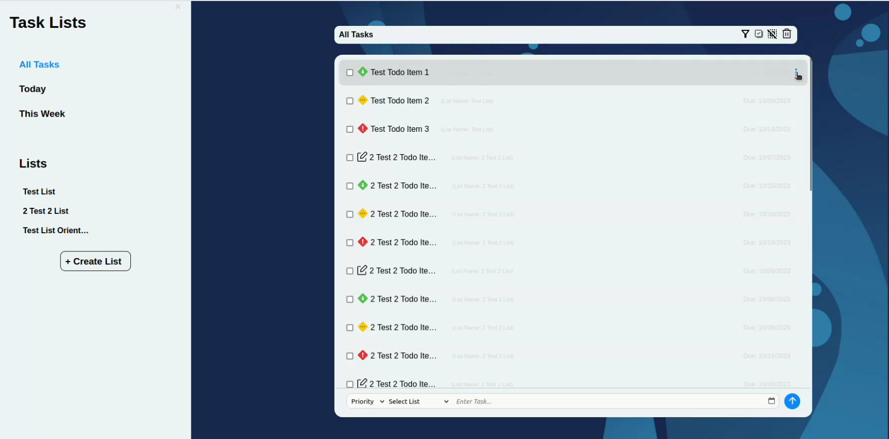

## Read Below for usage instructions and then checkout Live Web App at [lmdeguia.github.io/TaskList](https://lmdeguia.github.io/TaskList)

# Landing Page of Task Lists

# Notes on How to Use

Much of the functionality here is pretty intuitive to use. However, opening specific task list or task details view might be difficult to find, so I will detail the process below.

## Open Task Details in Collective Pane

### 1. Find the three dots icon on desired item to open

### 2. Left-Click The Icon to open pop-up menu then left-click "View Item"

### 3. Enjoy

## Open Lists

### 1. Find the three dots icon on desired list to open

### 2. Left-Click The Icon to open pop-up menu then left-click "View List"

### 3. MMMmm Tasty

## Open Task Details within List

### 1. Find the three dots icon on desired item to open

### 2. Left-Click The Icon to open pop-up menu then left-click "View Item"

### 3. Oh yes

# If (for some reason) you want to download this and run locally

## 1. Have Node.js Installed.
## 2. Run `npm install`
## 3. Open `./docs/index.html` in a web browser